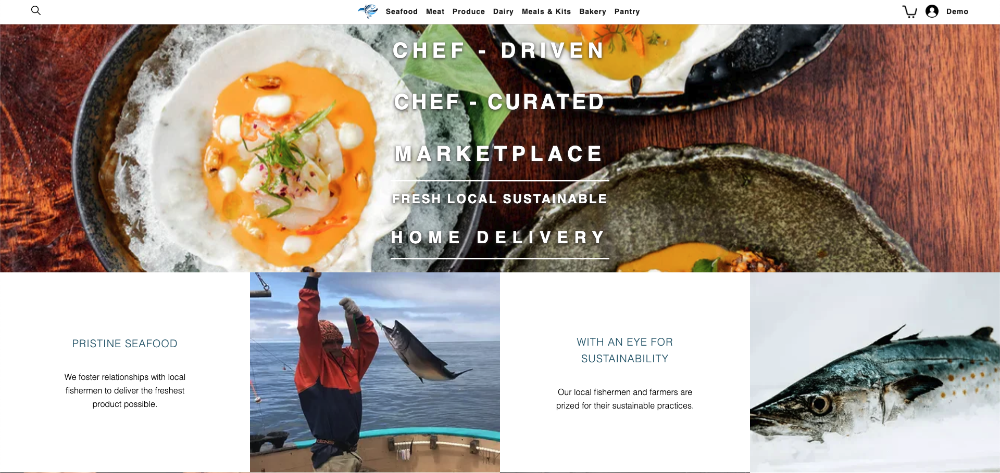

# Five Star Seafood

My site is a clone of the [Four Star Seafood](https://www.fourstarseafood.com/) site. On [Five Star Seafood](https://five-star-seafood.onrender.com/) you can create an account, browse products, add/remove products from your cart, checkout your cart, and write/edit/delete reviews for products.

## Tech Stack utilized:
- Javascript
- Node.js
- Flask.js
- React
- Redux
- SQLalchemy
- Python 3
- Alembic
- JSX
- SQLite3
- Html/CSS

### Database:
[Postgres](https://www.postgresql.org/)

## Wiki Links:
- [MVP Feature List](https://github.com/vinceviet/five-star-seafood/wiki/MVP-Feature-List)
- [DB schema with relationships](https://github.com/vinceviet/five-star-seafood/wiki/DB-Schema)
- [User Stories](https://github.com/vinceviet/five-star-seafood/wiki/User-Stories)
- [Wireframes](https://github.com/vinceviet/five-star-seafood/wiki/Wireframes)

## Hosting:
[Render](https://render.com/)

## Landing Page:
From the landing page you can browse products by category and even add them to your cart before logging in or making an account. To checkout you will need to have an account.


## Running the app locally:

1. Clone this repository

2. Install dependencies

      ```bash
      pipenv install -r requirements.txt
      ```

3. Create a **.env** file based on the example with proper settings for your
   development environment

4. Make sure the SQLite3 database connection URL is in the **.env** file

5. This starter organizes all tables inside the `flask_schema` schema, defined
   by the `SCHEMA` environment variable.  Replace the value for
   `SCHEMA` with a unique name, **making sure you use the snake_case
   convention**.

6. Get into your pipenv, migrate your database, seed your database, and run your Flask app

   ```bash
   pipenv shell
   ```

   ```bash
   flask db upgrade
   ```

   ```bash
   flask seed all
   ```

   ```bash
   flask run
   ```

7. To run the React App in development, cd inside the `react-app` directory and type npm start.

## Contact:
Vince Viet
- [LinkedIn](https://www.linkedin.com/in/vincent-viet-72349272/)
- [Github](https://github.com/vinceviet)
